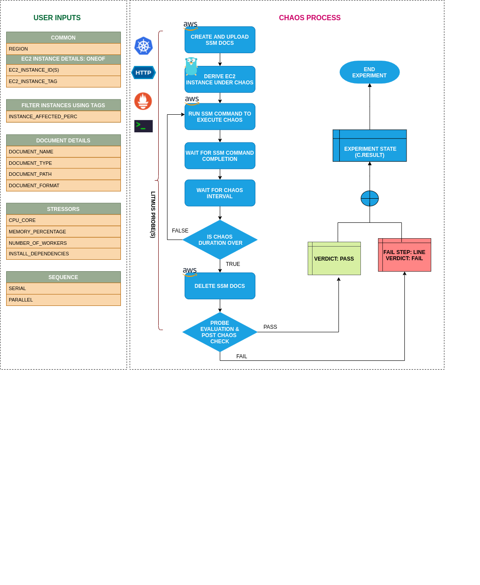

## Introduction

- AWS SSM Chaos By ID contains chaos to disrupt the state of infra resources. The experiment can induce chaos on AWS EC2 instance using Amazon SSM Run Command This is carried out by using SSM Docs that defines the actions performed by Systems Manager on your managed instances (having SSM agent installed) which let us perform chaos experiments on the instances.
- It causes chaos (like stress, network, disk or IO) on AWS EC2 instances with given instance ID(s) using SSM docs for a certain chaos duration.
- For the default execution the experiment uses SSM docs for stress-chaos while you can add your own SSM docs using configMap (.spec.definition.configMaps) in chaosexperiment CR.
- It tests deployment sanity (replica availability & uninterrupted service) and recovery workflows of the target application pod(if provided).

!!! tip "Scenario: AWS SSM Chaos"    
    

## Uses

??? info "View the uses of the experiment" 
    coming soon

## Prerequisites

??? info "Verify the prerequisites" 
    - Ensure that Kubernetes Version > 1.16 
    -  Ensure that the Litmus Chaos Operator is running by executing <code>kubectl get pods</code> in operator namespace (typically, <code>litmus</code>).If not, install from <a herf="https://docs.litmuschaos.io/docs/getstarted/#install-litmus">here</a>
    -  Ensure that the <code>aws-ssm-chaos-by-id</code> experiment resource is available in the cluster by executing <code>kubectl get chaosexperiments</code> in the desired namespace. If not, install from <a herf="https://hub.litmuschaos.io/api/chaos/master?file=charts/aws-ssm/aws-ssm-chaos-by-id/experiment.yaml">here</a>
    - Ensure that you have the required AWS access and your target EC2 instances have attached an IAM instance profile. To know more checkout [Systems Manager Docs](https://docs.aws.amazon.com/systems-manager/latest/userguide/setup-launch-managed-instance.html).
    - Ensure to create a Kubernetes secret having the AWS access configuration(key) in the `CHAOS_NAMESPACE`. A sample secret file looks like:

        ```yaml
        apiVersion: v1
        kind: Secret
        metadata:
          name: cloud-secret
        type: Opaque
        stringData:
          cloud_config.yml: |-
            # Add the cloud AWS credentials respectively
            [default]
            aws_access_key_id = XXXXXXXXXXXXXXXXXXX
            aws_secret_access_key = XXXXXXXXXXXXXXX
        ```
    - If you change the secret key name (from `cloud_config.yml`) please also update the `AWS_SHARED_CREDENTIALS_FILE` 
    ENV value on `experiment.yaml`with the same name.
    
## Default Validations

??? info "View the default validations" 
    - EC2 instance should be in healthy state.

## Minimal RBAC configuration example (optional)

??? note "View the Minimal RBAC permissions"

    [embedmd]:# (https://raw.githubusercontent.com/litmuschaos/chaos-charts/master/charts/aws-ssm/aws-ssm-chaos-by-id/rbac.yaml yaml)
    ```yaml
    ---
    apiVersion: v1
    kind: ServiceAccount
    metadata:
      name: aws-ssm-chaos-by-id-sa
      namespace: default
      labels:
        name: aws-ssm-chaos-by-id-sa
        app.kubernetes.io/part-of: litmus
    ---
    apiVersion: rbac.authorization.k8s.io/v1
    kind: ClusterRole
    metadata:
      name: aws-ssm-chaos-by-id-sa
      labels:
        name: aws-ssm-chaos-by-id-sa
        app.kubernetes.io/part-of: litmus
    rules:
    - apiGroups: [""]
      resources: ["pods","events","secrets","configmaps"]
      verbs: ["create","list","get","patch","update","delete","deletecollection"]
    - apiGroups: [""]
      resources: ["pods/exec","pods/log"]
      verbs: ["create","list","get"]
    - apiGroups: ["batch"]
      resources: ["jobs"]
      verbs: ["create","list","get","delete","deletecollection"]
    - apiGroups: ["litmuschaos.io"]
      resources: ["chaosengines","chaosexperiments","chaosresults"]
      verbs: ["create","list","get","patch","update"]
    ---
    apiVersion: rbac.authorization.k8s.io/v1
    kind: ClusterRoleBinding
    metadata:
      name: aws-ssm-chaos-by-id-sa
      labels:
        name: aws-ssm-chaos-by-id-sa
        app.kubernetes.io/part-of: litmus
    roleRef:
      apiGroup: rbac.authorization.k8s.io
      kind: ClusterRole
      name: aws-ssm-chaos-by-id-sa
    subjects:
    - kind: ServiceAccount
      name: aws-ssm-chaos-by-id-sa
      namespace: default
    ```
    Use this sample RBAC manifest to create a chaosServiceAccount in the desired (app) namespace. This example consists of the minimum necessary role permissions to execute the experiment.

## Experiment tunables

??? info "check the experiment tunables"
    <h2>Mandatory Fields</h2>

    <table>
      <tr>
        <th> Variables </th>
        <th> Description </th>
        <th> Notes </th>
      </tr>
      <tr> 
        <td> EC2_INSTANCE_ID </td>
        <td> Instance ID of the target ec2 instance. Multiple IDs can also be provided as a comma(,) separated values</td>
        <td> Multiple IDs can be provided as `id1,id2` </td>
      </tr>
    </table>
    
    <h2>Optional Fields</h2>

    <table>
      <tr>
        <th> Variables </th>
        <th> Description </th>
        <th> Notes </th>
      </tr>
      <tr> 
        <td> TOTAL_CHAOS_DURATION </td>
        <td> The total time duration for chaos insertion (sec) </td>
        <td> Defaults to 30s </td>
      </tr>
      <tr> 
        <td> CHAOS_INTERVAL </td>
        <td> The interval (in sec) between successive chaos injection</td>
        <td> Defaults to 60s </td>
      </tr>  
      <tr> 
        <td> AWS_SHARED_CREDENTIALS_FILE </td>
        <td> Provide the path for aws secret credentials</td>
        <td> Defaults to <code>/tmp/cloud_config.yml</code> </td>
      </tr>
      <tr> 
        <td> DOCUMENT_NAME </td>
        <td> Provide the name of addded ssm docs (if not using the default docs)</td>
        <td> Default to LitmusChaos-AWS-SSM-Doc</td>
      </tr>
      <tr> 
        <td> DOCUMENT_FORMAT </td>
        <td> Provide the format of the ssm docs. It can be YAML or JSON</td>
        <td> Defaults to <code>YAML</code> </td>
      </tr>
      <tr> 
        <td> DOCUMENT_TYPE </td>
        <td> Provide the document type of added ssm docs (if not using the default docs)</td>
        <td> Defaults to <code>Command</code> </td>
      </tr>
      <tr> 
        <td> DOCUMENT_PATH </td>
        <td> Provide the document path if added using configmaps</td>
        <td> Defaults to the litmus ssm docs path </td>
      </tr>
      <tr> 
        <td> INSTALL_DEPENDENCIES </td>
        <td> Select to install dependencies used to run stress-ng with default docs. It can be either True or False</td>
        <td> Defaults to True </td>
      </tr>
      <tr> 
        <td> NUMBER_OF_WORKERS </td>
        <td> Provide the number of workers to run stress-chaos with default ssm docs</td>
        <td> Defaults to 1 </td>
      </tr>
      <tr> 
        <td> MEMORY_PERCENTAGE </td>
        <td> Provide the memory consumption in percentage on the instance for default ssm docs</td>
        <td> Defaults to 80 </td>
      </tr>
      <tr> 
        <td> CPU_CORE </td>
        <td> Provide the number of cpu cores to run stress-chaos on EC2 with default ssm docs</td>
        <td> Defaults to 0. It means it'll consume all the available cpu cores on the instance </td>
      </tr>
      <tr>
        <td> SEQUENCE </td>
        <td> It defines sequence of chaos execution for multiple instance</td>
        <td> Default value: parallel. Supported: serial, parallel </td>
      </tr>
      <tr>
        <td> RAMP_TIME </td>
        <td> Period to wait before and after injection of chaos in sec </td>
        <td> </td>
      </tr>    
      <tr>
        <td> REGION </td>
        <td> The region name of the target instace</td>
        <td> </td>
      </tr> 
    </table>

## Experiment Examples

### Common and AWS-SSM specific tunables

Refer the [common attributes](../common/common-tunables-for-all-experiments.md) and [AWS-SSM specific tunable](AWS-SSM-experiments-tunables.md) to tune the common tunables for all experiments and aws-ssm specific tunables.  

### Stress Instances By ID

It contains comma separated list of instances IDs subjected to ec2 stop chaos. It can be tuned via `EC2_INSTANCE_ID` ENV.

Use the following example to tune this:

[embedmd]:# (https://raw.githubusercontent.com/ispeakc0de/litmus/experiments-by-example/docs/experiments/categories/aws-ssm/aws-ssm-chaos-by-id/instance-id.yaml yaml)
```yaml
apiVersion: litmuschaos.io/v1alpha1
kind: ChaosEngine
metadata:
  name: engine-nginx
spec:
  engineState: "active"
  annotationCheck: "false"
  chaosServiceAccount: aws-ssm-chaos-by-id-sa
  experiments:
  - name: aws-ssm-chaos-by-id
    spec:
      components:
        env:
        # comma separated list of ec2 instance id(s)
        # all instances should belongs to the same region(REGION)
        - name: EC2_INSTANCE_ID
          value: 'instance-01,instance-02'
        # region of the ec2 instance
        - name: REGION
          value: '<region of the EC2_INSTANCE_ID>'
        - name: TOTAL_CHAOS_DURATION
          VALUE: '60'
```
