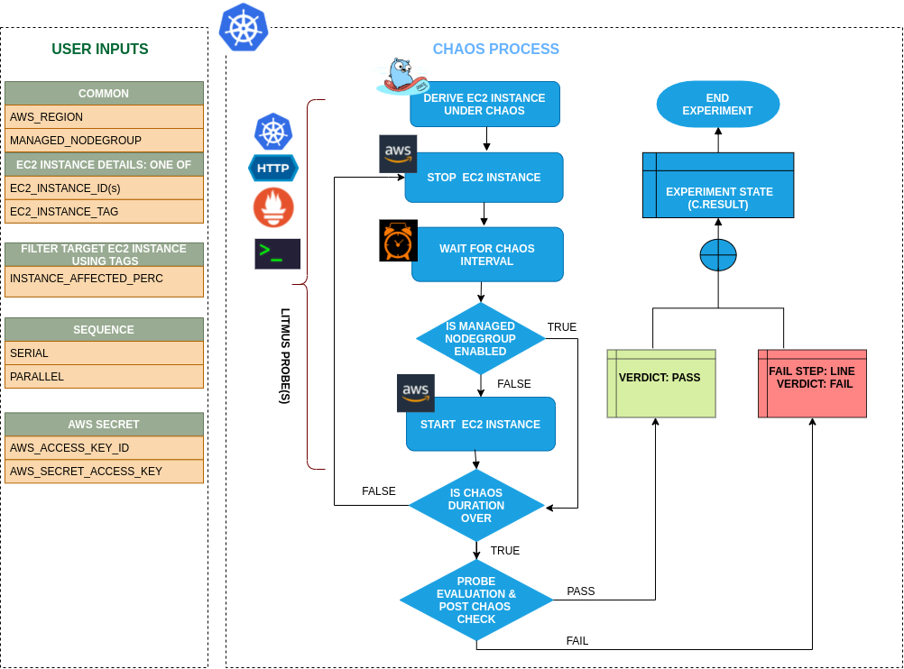

## Introduction

- It causes stopping of an EC2 instance by instance ID or list of instance IDs before bringing it back to running state after the specified chaos duration.
- It helps to check the performance of the application/process running on the ec2 instance.
When the MANAGED_NODEGROUP is enable then the experiment will not try to start the instance post chaos instead it will check of the addition of the new node instance to the cluster.

!!! tip "Scenario: Stop EC2 Instance"
    

## Uses

??? info "View the uses of the experiment" 
    coming soon

## Prerequisites

??? info "Verify the prerequisites" 
    - Ensure that Kubernetes Version > 1.16 
    -  Ensure that the Litmus Chaos Operator is running by executing <code>kubectl get pods</code> in operator namespace (typically, <code>litmus</code>).If not, install from <a href="https://v1-docs.litmuschaos.io/docs/getstarted/#install-litmus">here</a>
    -  Ensure that the <code>ec2-stop-by-id</code> experiment resource is available in the cluster by executing <code>kubectl get chaosexperiments</code> in the desired namespace. If not, install from <a href="https://hub.litmuschaos.io/api/chaos/master?file=faults/aws/ec2-stop-by-id/fault.yaml">here</a>
    - Ensure that you have sufficient AWS access to stop and start an ec2 instance. 
    - Ensure to create a Kubernetes secret having the AWS access configuration(key) in the `CHAOS_NAMESPACE`. A sample secret file looks like:

        ```yaml
        apiVersion: v1
        kind: Secret
        metadata:
          name: cloud-secret
        type: Opaque
        stringData:
          cloud_config.yml: |-
            # Add the cloud AWS credentials respectively
            [default]
            aws_access_key_id = XXXXXXXXXXXXXXXXXXX
            aws_secret_access_key = XXXXXXXXXXXXXXX
        ```
    - If you change the secret key name (from `cloud_config.yml`) please also update the `AWS_SHARED_CREDENTIALS_FILE` 
    ENV value on `experiment.yaml`with the same name.

    ### WARNING

    If the target EC2 instance is a part of a self-managed nodegroup:
    Make sure to drain the target node if any application is running on it and also ensure to cordon the target node before running the experiment so that the experiment pods do not schedule on it. 
    
## Default Validations

??? info "View the default validations" 
    - EC2 instance should be in healthy state.

## Minimal RBAC configuration example (optional)

!!! tip "NOTE"   
    If you are using this experiment as part of a litmus workflow scheduled constructed & executed from chaos-center, then you may be making use of the [litmus-admin](https://litmuschaos.github.io/litmus/litmus-admin-rbac.yaml) RBAC, which is pre installed in the cluster as part of the agent setup.

    ??? note "View the Minimal RBAC permissions"

        [embedmd]:# (https://raw.githubusercontent.com/litmuschaos/chaos-charts/master/charts/kube-aws/ec2-stop-by-id/rbac.yaml yaml)
        ```yaml
        ---
        apiVersion: v1
        kind: ServiceAccount
        metadata:
          name: ec2-stop-by-id-sa
          namespace: default
          labels:
            name: ec2-stop-by-id-sa
            app.kubernetes.io/part-of: litmus
        ---
        apiVersion: rbac.authorization.k8s.io/v1
        kind: ClusterRole
        metadata:
          name: ec2-stop-by-id-sa
          labels:
            name: ec2-stop-by-id-sa
            app.kubernetes.io/part-of: litmus
        rules:
          # Create and monitor the experiment & helper pods
          - apiGroups: [""]
            resources: ["pods"]
            verbs: ["create","delete","get","list","patch","update", "deletecollection"]
          # Performs CRUD operations on the events inside chaosengine and chaosresult
          - apiGroups: [""]
            resources: ["events"]
            verbs: ["create","get","list","patch","update"]
          # Fetch configmaps & secrets details and mount it to the experiment pod (if specified)
          - apiGroups: [""]
            resources: ["secrets","configmaps"]
            verbs: ["get","list",]
          # Track and get the runner, experiment, and helper pods log 
          - apiGroups: [""]
            resources: ["pods/log"]
            verbs: ["get","list","watch"]  
          # for creating and managing to execute comands inside target container
          - apiGroups: [""]
            resources: ["pods/exec"]
            verbs: ["get","list","create"]
          # for configuring and monitor the experiment job by the chaos-runner pod
          - apiGroups: ["batch"]
            resources: ["jobs"]
            verbs: ["create","list","get","delete","deletecollection"]
          # for creation, status polling and deletion of litmus chaos resources used within a chaos workflow
          - apiGroups: ["litmuschaos.io"]
            resources: ["chaosengines","chaosexperiments","chaosresults"]
            verbs: ["create","list","get","patch","update","delete"]
          # for experiment to perform node status checks
          - apiGroups: [""]
            resources: ["nodes"]
            verbs: ["get","list"]
        ---
        apiVersion: rbac.authorization.k8s.io/v1
        kind: ClusterRoleBinding
        metadata:
          name: ec2-stop-by-id-sa
          labels:
            name: ec2-stop-by-id-sa
            app.kubernetes.io/part-of: litmus
        roleRef:
          apiGroup: rbac.authorization.k8s.io
          kind: ClusterRole
          name: ec2-stop-by-id-sa
        subjects:
        - kind: ServiceAccount
          name: ec2-stop-by-id-sa
          namespace: default
        ```
        
        Use this sample RBAC manifest to create a chaosServiceAccount in the desired (app) namespace. This example consists of the minimum necessary role permissions to execute the experiment.

## Experiment tunables

??? info "check the experiment tunables"
    <h2>Mandatory Fields</h2>

    <table>
      <tr>
        <th> Variables </th>
        <th> Description </th>
        <th> Notes </th>
      </tr>
      <tr> 
        <td> EC2_INSTANCE_ID </td>
        <td> Instance ID of the target ec2 instance. Multiple IDs can also be provided as a comma(,) separated values</td>
        <td> Multiple IDs can be provided as `id1,id2` </td>
      </tr>
      <tr>
        <td> REGION </td>
        <td> The region name of the target instace</td>
        <td> </td>
      </tr> 
    </table>
    
    <h2>Optional Fields</h2>

    <table>
      <tr>
        <th> Variables </th>
        <th> Description </th>
        <th> Notes </th>
      </tr>
      <tr> 
        <td> TOTAL_CHAOS_DURATION </td>
        <td> The total time duration for chaos insertion (sec) </td>
        <td> Defaults to 30s </td>
      </tr>
      <tr> 
        <td> CHAOS_INTERVAL </td>
        <td> The interval (in sec) between successive instance stop.</td>
        <td> Defaults to 30s </td>
      </tr>  
      <tr> 
        <td> MANAGED_NODEGROUP </td>
        <td> Set to <code>enable</code> if the target instance is the part of self-managed nodegroups </td>
        <td> Defaults to <code>disable</code> </td>
      </tr>  
      <tr>
        <td> SEQUENCE </td>
        <td> It defines sequence of chaos execution for multiple instance</td>
        <td> Default value: parallel. Supported: serial, parallel </td>
      </tr>
      <tr>
        <td> RAMP_TIME </td>
        <td> Period to wait before and after injection of chaos in sec </td>
        <td> </td>
      </tr>    
    </table>

## Experiment Examples

### Common and AWS specific tunables

Refer the [common attributes](../common/common-tunables-for-all-experiments.md) and [AWS specific tunable](AWS-experiments-tunables.md) to tune the common tunables for all experiments and aws specific tunables.  

### Stop Instances By ID

It contains comma separated list of instances IDs subjected to ec2 stop chaos. It can be tuned via `EC2_INSTANCE_ID` ENV.

Use the following example to tune this:

[embedmd]:# (https://raw.githubusercontent.com/litmuschaos/litmus/master/mkdocs/docs/experiments/categories/aws/ec2-stop-by-id/instance-id.yaml yaml)
```yaml
# contains the instance id to be stopped
apiVersion: litmuschaos.io/v1alpha1
kind: ChaosEngine
metadata:
  name: engine-nginx
spec:
  engineState: "active"
  annotationCheck: "false"
  chaosServiceAccount: ec2-stop-by-id-sa
  experiments:
  - name: ec2-stop-by-id
    spec:
      components:
        env:
        # id of the ec2 instance
        - name: EC2_INSTANCE_ID
          value: 'instance-1'
        # region for the ec2 instance
        - name: REGION
          value: '<region for EC2_INSTANCE_ID>'
        - name: TOTAL_CHAOS_DURATION
          VALUE: '60'
```
