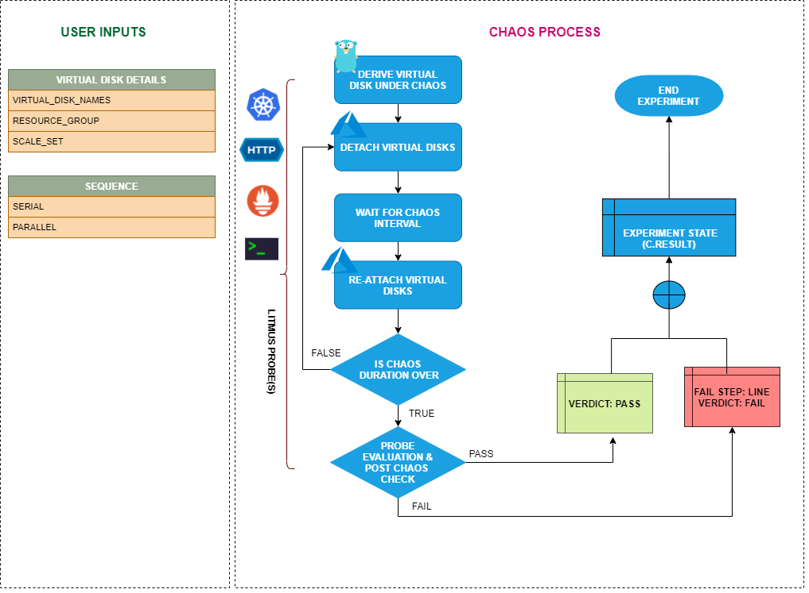

## Introduction

- It causes detachment of virtual disk from an Azure instance before re-attaching it back to the instance after the specified chaos duration.
- It helps to check the performance of the application/process running on the instance.

<!-- TODO: Add image -->
!!! tip "Scenario: Detach the virtual disk from instance"    
    

## Uses

??? info "View the uses of the experiment" 
    coming soon

## Prerequisites

??? info "Verify the prerequisites" 
    - Ensure that Kubernetes Version > 1.16 
    -  Ensure that the Litmus Chaos Operator is running by executing <code>kubectl get pods</code> in operator namespace (typically, <code>litmus</code>).If not, install from <a herf="https://docs.litmuschaos.io/docs/getstarted/#install-litmus">here</a>
    -  Ensure that the <code>azure-disk-loss</code> experiment resource is available in the cluster by executing <code>kubectl get chaosexperiments</code> in the desired namespace. If not, install from <a herf="https://hub.litmuschaos.io/api/chaos/master?file=charts/azure/azure-disk-loss/experiment.yaml">here</a>
    - Ensure that you have sufficient Azure access to detach and attach a disk. 
    - We will use azure [ file-based authentication ](https://docs.microsoft.com/en-us/azure/developer/go/azure-sdk-authorization#use-file-based-authentication) to connect with the instance using azure GO SDK in the experiment. For generating auth file run `az ad sp create-for-rbac --sdk-auth > azure.auth` Azure CLI command.
    - Ensure to create a Kubernetes secret having the auth file created in the step in `CHAOS_NAMESPACE`. A sample secret file looks like:

        ```yaml
        apiVersion: v1
        kind: Secret
        metadata:
          name: cloud-secret
        type: Opaque
        stringData:
          azure.auth: |-
            {
              "clientId": "XXXXXXXXX",
              "clientSecret": "XXXXXXXXX",
              "subscriptionId": "XXXXXXXXX",
              "tenantId": "XXXXXXXXX",
              "activeDirectoryEndpointUrl": "XXXXXXXXX",
              "resourceManagerEndpointUrl": "XXXXXXXXX",
              "activeDirectoryGraphResourceId": "XXXXXXXXX",
              "sqlManagementEndpointUrl": "XXXXXXXXX",
              "galleryEndpointUrl": "XXXXXXXXX",
              "managementEndpointUrl": "XXXXXXXXX"
            }
        ```
    - If you change the secret key name (from `azure.auth`) please also update the `AZURE_AUTH_LOCATION` 
    ENV value on `experiment.yaml`with the same name.
    
## Default Validations

??? info "View the default validations" 
    - Azure Disk should be connected to an instance.

## Minimal RBAC configuration example (optional)
!!! tip "NOTE"   
    If you are using this experiment as part of a litmus workflow scheduled constructed & executed from chaos-center, then you may be making use of the [litmus-admin](https://litmuschaos.github.io/litmus/litmus-admin-rbac.yaml) RBAC, which is pre installed in the cluster as part of the agent setup.

    ??? note "View the Minimal RBAC permissions"

        [embedmd]:# (https://raw.githubusercontent.com/litmuschaos/chaos-charts/master/charts/azure/azure-disk-loss/rbac.yaml yaml)
        
        ```yaml
        ---
        apiVersion: v1
        kind: ServiceAccount
        metadata:
        name: azure-disk-loss-sa
        namespace: default
        labels:
            name: azure-disk-loss-sa
            app.kubernetes.io/part-of: litmus
        ---
        apiVersion: rbac.authorization.k8s.io/v1
        kind: ClusterRole
        metadata:
        name: azure-disk-loss-sa
        labels:
            name: azure-disk-loss-sa
            app.kubernetes.io/part-of: litmus
        rules:
        - apiGroups: ["","litmuschaos.io","batch"]
        resources: ["pods","jobs","secrets","events","pods/log","pods/exec","chaosengines","chaosexperiments","chaosresults"]
        verbs: ["create","list","get","patch","update","delete"]
        ---
        apiVersion: rbac.authorization.k8s.io/v1
        kind: ClusterRoleBinding
        metadata:
        name: azure-disk-loss-sa
        labels:
            name: azure-disk-loss-sa
            app.kubernetes.io/part-of: litmus
        roleRef:
        apiGroup: rbac.authorization.k8s.io
        kind: ClusterRole
        name: azure-disk-loss-sa
        subjects:
        - kind: ServiceAccount
        name: azure-disk-loss-sa
        namespace: default
        ```

## Experiment tunables

??? info "check the experiment tunables"
    <h2>Mandatory Fields</h2>

    <table>
        <tr>
            <th> Variables </th>
            <th> Description </th>
            <th> Notes </th>
        </tr>
        <tr>
            <td> SCALE_SET </td>
            <td> Whether disk is connected to Scale set instance</td>
            <td> Accepts "enable"/"disable". Default is "disable"</td>
        </tr>
        <tr> 
            <td> VIRTUAL_DISK_NAMES </td>
            <td> Name of virtual disks to target.</td>
            <td> Provide comma separated names for multiple disks</td>
        </tr>
        <tr>
            <td> RESOURCE_GROUP </td>
            <td> The resource group of the target disk(s)</td>
            <td> </td>
        </tr> 
    </table>
    
    <h2>Optional Fields</h2>

    <table>
        <tr>
            <th> Variables </th>
            <th> Description </th>
            <th> Notes </th>
        </tr>
        <tr> 
            <td> TOTAL_CHAOS_DURATION </td>
            <td> The total time duration for chaos insertion (sec) </td>
            <td> Defaults to 30s </td>
        </tr>
        <tr> 
            <td> CHAOS_INTERVAL </td>
            <td> The interval (in sec) between successive instance poweroff.</td>
            <td> Defaults to 30s </td>
        </tr>
        <tr>
            <td> SEQUENCE </td>
            <td> It defines sequence of chaos execution for multiple instance</td>
            <td> Default value: parallel. Supported: serial, parallel </td>
        </tr>
        <tr>
            <td> RAMP_TIME </td>
            <td> Period to wait before and after injection of chaos in sec </td>
            <td> </td>
        </tr>
    </table>

## Experiment Examples

### Common Experiment Tunables

Refer the [common attributes](../common/common-tunables-for-all-experiments.md) to tune the common tunables for all the experiments.

### Detach Virtual Disks By Name

It contains comma separated list of disk names subjected to disk loss chaos. It can be tuned via `VIRTUAL_DISK_NAMES` ENV.

Use the following example to tune this:

[embedmd]:# (https://raw.githubusercontent.com/litmuschaos/litmus/master/mkdocs/docs/experiments/categories/azure/azure-disk-loss/azure-disks.yaml yaml)
```yaml
# detach multiple azure disks by their names 
apiVersion: litmuschaos.io/v1alpha1
kind: ChaosEngine
metadata:
  name: engine-nginx
spec:
  engineState: "active"
  annotationCheck: "false"
  chaosServiceAccount: azure-disk-loss-sa
  experiments:
  - name: azure-disk-loss
    spec:
      components:
        env:
        # comma separated names of the azure disks attached to VMs
        - name: VIRTUAL_DISK_NAMES
          value: 'disk-01,disk-02'
        # name of the resource group
        - name: RESOURCE_GROUP
          value: '<resource group of VIRTUAL_DISK_NAMES>'
        - name: TOTAL_CHAOS_DURATION
          VALUE: '60'
```


### Detach Virtual Disks Attached to Scale Set Instances By Name

It contains comma separated list of disk names attached to scale set instances subjected to disk loss chaos. It can be tuned via `VIRTUAL_DISK_NAMES` and `SCALE_SET` ENV.

Use the following example to tune this:

[embedmd]:# (https://raw.githubusercontent.com/litmuschaos/litmus/master/mkdocs/docs/experiments/categories/azure/azure-disk-loss/azure-scale-set-disk.yaml yaml)
```yaml
# detach multiple azure disks attached to scale set VMs by their names
apiVersion: litmuschaos.io/v1alpha1
kind: ChaosEngine
metadata:
  name: engine-nginx
spec:
  engineState: "active"
  annotationCheck: "false"
  chaosServiceAccount: azure-disk-loss-sa
  experiments:
  - name: azure-disk-loss
    spec:
      components:
        env:
        # comma separated names of the azure disks attached to scale set VMs
        - name: VIRTUAL_DISK_NAMES
          value: 'disk-01,disk-02'
        # name of the resource group
        - name: RESOURCE_GROUP
          value: '<resource group of VIRTUAL_DISK_NAMES>'
        # VM belongs to scale set or not
        - name: SCALE_SET
          value: 'enable'
        - name: TOTAL_CHAOS_DURATION
          VALUE: '60'
```

### Multiple Iterations Of Chaos

The multiple iterations of chaos can be tuned via setting `CHAOS_INTERVAL` ENV. Which defines the delay between each iteration of chaos.

Use the following example to tune this:

[embedmd]:# (https://raw.githubusercontent.com/litmuschaos/litmus/master/mkdocs/docs/experiments/categories/azure/azure-disk-loss/chaos-interval.yaml yaml)
```yaml
# defines delay between each successive iteration of the chaos
apiVersion: litmuschaos.io/v1alpha1
kind: ChaosEngine
metadata:
  name: engine-nginx
spec:
  engineState: "active"
  annotationCheck: "false"
  chaosServiceAccount: azure-disk-loss-sa
  experiments:
  - name: azure-disk-loss
    spec:
      components:
        env:
        # delay between each iteration of chaos
        - name: CHAOS_INTERVAL
          value: '10'
         # time duration for the chaos execution
        - name: TOTAL_CHAOS_DURATION
          VALUE: '60'
        - name: VIRTUAL_DISK_NAMES
          value: 'disk-01,disk-02'
        - name: RESOURCE_GROUP
          value: '<resource group of VIRTUAL_DISK_NAMES>'
```