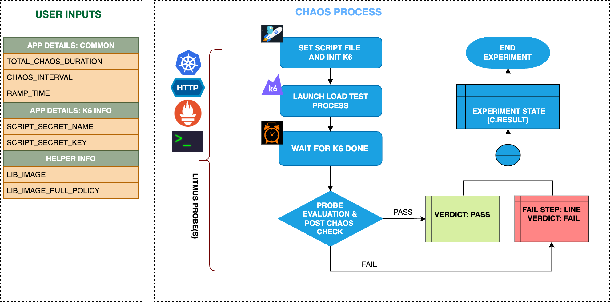

## Introduction

[k6](https://k6.io/) loadgen fault simulates load generation on the target hosts for a specific chaos duration. This fault:
- Slows down or makes the target host unavailable due to heavy load.
- Checks the performance of the application or process running on the instance.
Support [various types](https://grafana.com/docs/k6/latest/testing-guides/test-types/) of load testing (ex. spike, smoke, stress)

!!! tip "Scenario: Load generating with k6"    
    

## Uses

??? info "View the uses of the experiment" 
    coming soon

## Prerequisites

??? info "Verify the prerequisites" 
    - Ensure that Kubernetes Version > 1.16 
    - Ensure that the Litmus Chaos Operator is running by executing <code>kubectl get pods</code> in operator namespace (typically, <code>litmus</code>).If not, install from <a href="https://docs.litmuschaos.io/docs/getting-started/installation">here</a>
    - Ensure to create a Kubernetes secret having the JS script file in the `Chaos Infrastructure`'s namespace(typically litmus). The simplest way to create a secret object looks like this:
            ```bash
            kubectl create secret generic k6-script \
                --from-file=script.js=<<script-path>> -n <<chaos_infrastructure_namespace>>
            ``` 

## Default Validations

??? info "View the default validations" 
    The application pods should be in running state before and after chaos injection.

## Minimal RBAC configuration example (optional)

!!! tip "NOTE"   
    If you are using this experiment as part of a litmus workflow scheduled constructed & executed from chaos-center, then you may be making use of the [litmus-admin](https://litmuschaos.github.io/litmus/litmus-admin-rbac.yaml) RBAC, which is pre installed in the cluster as part of the agent setup.

    ??? note "View the Minimal RBAC permissions"

        ```yaml
        ---
        apiVersion: v1
        kind: ServiceAccount
        metadata:
        name: k6-loadgen-sa
        namespace: default
        labels:
        name: k6-loadgen-sa
        ---
        apiVersion: rbac.authorization.k8s.io/v1
        kind: Role
        metadata:
        name: k6-loadgen-sa
        namespace: default
        labels:
        name: k6-loadgen-sa
        rules:
        - apiGroups: ["","litmuschaos.io","batch","apps"]
          resources: ["pods","configmaps","jobs","pods/exec","pods/log","events","chaosengines","chaosexperiments","chaosresults"]
          verbs: ["create","list","get","patch","update","delete","deletecollection"]
        ---
        apiVersion: rbac.authorization.k8s.io/v1
        kind: RoleBinding
        metadata:
        name: k6-loadgen-sa
        namespace: default
        labels:
        name: k6-loadgen-sa
        roleRef:
        apiGroup: rbac.authorization.k8s.io
        kind: Role
        name: k6-loadgen-sa
        subjects:
        - kind: ServiceAccount
          name: k6-loadgen-sa
          namespace: default

        ```
        Use this sample RBAC manifest to create a chaosServiceAccount in the desired (app) namespace. This example consists of the minimum necessary role permissions to execute the experiment.

## Experiment tunables

??? info "check the experiment tunables" 
    <h2>Optional Fields</h2>

    <table>
      <tr>
        <th> Variables </th>
        <th> Description  </th>
        <th> Notes </th>
      </tr>
      <tr>
        <td> TOTAL_CHAOS_DURATION  </td>
        <td> The time duration for chaos injection (seconds) </td>
        <td> Defaults to 20s </td>
      </tr>
      <tr>
        <td> CHAOS_INTERVAL  </td>
        <td> Time interval b/w two successive k6-loadgen (in sec) </td>
        <td> If the CHAOS_INTERVAL is not provided it will take the default value of 10s </td>
      </tr>
      <tr>
        <td> RAMP_TIME </td>
        <td> Period to wait before injection of chaos in sec </td>
        <td> </td>
      </tr>
      <tr>
        <td> LIB_IMAGE  </td>
        <td> LIB Image used to excute k6 engine </td>
        <td> Defaults to <code>ghcr.io/grafana/k6-operator:latest-runner</code></td>
      </tr>
      <tr>
        <td> LIBImagePullPolicy  </td>
        <td> LIB Image pull policy </td>
        <td> Defaults to <code>Always</code> </td> 
      </tr>
      <tr>
        <td> SCRIPT_SECRET_NAME </td>
        <td> Provide the k8s secret name of the JS script to run k6. </td>
        <td> Default value: k6-script </td>
      </tr>
      <tr>
        <td> SCRIPT_SECRET_KEY </td>
        <td> Provide the key of the k8s secret named SCRIPT_SECRET_NAME </td>
        <td> Default value: script.js </td>
      </tr>
    </table>

## Experiment Examples

### Common and Pod specific tunables

Refer the [common attributes](../common/common-tunables-for-all-experiments.md) and [Pod specific tunable](common-tunables-for-pod-experiments.md) to tune the common tunables for all experiments and pod specific tunables.  

### Custom k6 configuration
You can add k6 options(ex hosts, thresholds) in the script `options` object. More details can be found [here](https://grafana.com/docs/k6/latest/using-k6/k6-options/)

### Custom Secret Name and Secret Key

You can provide the secret name and secret key of the JS script to be used for k6-loadgen. The secret should be created in the same namespace where the `chaos infrastructure` is created. For example, if the chaos infrastructure is created in the `litmus` namespace, then the secret should also be created in the `litmus` namespace. And If we want to use `custom-k6-script` secret and `custom-script.js` as the secret key, then the experiment tunable will look like this:

[embedmd]:# (./k6-loadgen/k6-loadgen.yaml yaml)
```yaml
---
apiVersion: litmuschaos.io/v1alpha1
kind: ChaosEngine
metadata:
  name: nginx-chaos
  namespace: default
spec:
  engineState: 'active'
  chaosServiceAccount: litmus-admin
  experiments:
    - name: k6-loadgen
      spec:
        components:
          env:
            # set chaos duration (in sec) as desired
            - name: TOTAL_CHAOS_DURATION
              value: "30"

            # Interval between chaos injection in sec
            - name: CHAOS_INTERVAL
              value: "30"

            # Period to wait before and after injection of chaos in sec
            - name: RAMP_TIME
              value: "0"

            # Provide the secret name of the JS script
            - name: SCRIPT_SECRET_NAME
              value: "custom-k6-script"

            # Provide the secret key of the JS script
            - name: SCRIPT_SECRET_KEY
              value: "custom-script.js"

            # Provide the image name of the helper pod
            - name: LIB_IMAGE
              value: "ghcr.io/grafana/k6-operator:latest-runner"

            # Provide the image pull policy of the helper pod
            - name: LIBImagePullPolicy
              value: "Always"
```
